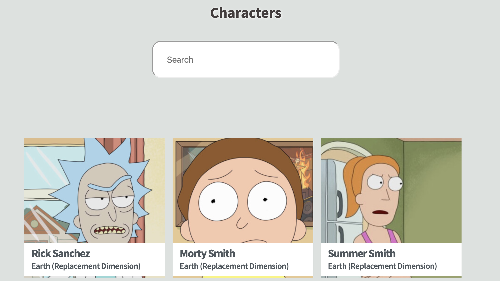
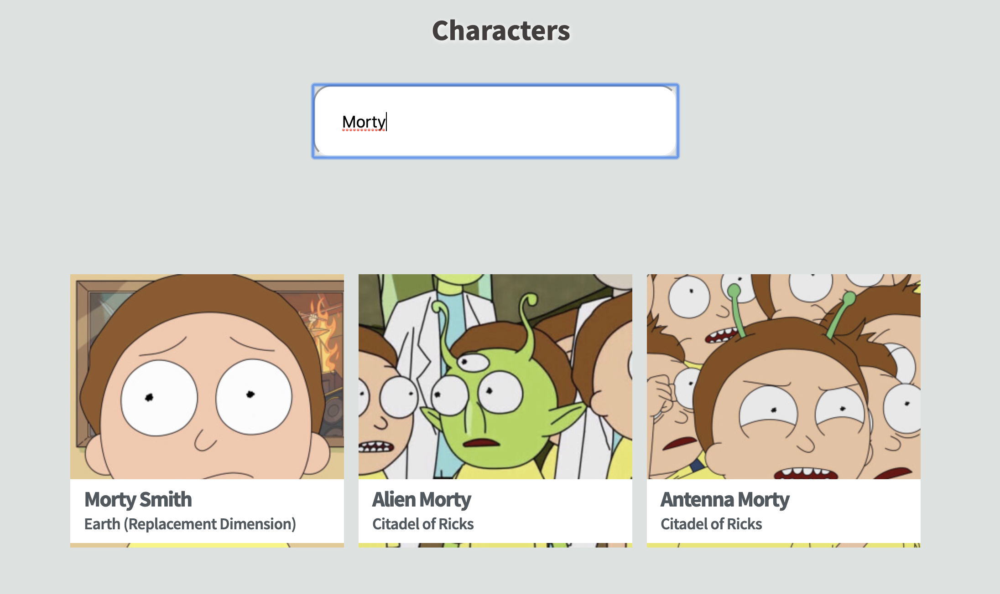

# Sprint Challenge: React - Star Wars

This Project explored ReactJS, Function Components, component state, side effects and styling techniques. Demonstrated proficiency by creating an application that uses ReactJS to consume live data retrieved from the World Wide Web and style that data nicely on the page.

## Minimum Viable Product

- [ ] Use ONE of the following APIs:
  - [The Rick and Morty API](https://rickandmortyapi.com/)
- [ ] Use the documentation and Google to fetch characters from API.
- [ ] Obtain a list of characters. One or several requests might be needed, depending on the API.
- [ ] Set the list of characters into state.
- [ ] Created a search form that will filter through the data displayed from your characters.
- [ ] Render your characters to the screen:
  - Build a React component named 'Character' to render an individual character.
  - Map over the list in state, and for each character render a Character to the page.

### Required best practices

- [ ] Consistent naming. Examples: variables, functions, Components, and file/folder organization.
- [ ] Consistent spacing. Examples: line breaks, around arguments and before/after functions.
- [ ] Consistent quotation usage.
- [ ] Spell-check.
